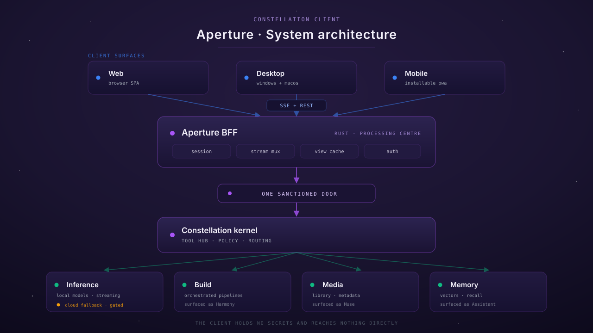

<p align="center">
  
</p>

<p align="center">
  
</p>

# Aperture

**The rich client for the Lumina Constellation — web, desktop, and mobile.**

Aperture is the surface a person actually uses. One React codebase ships as a web app, a
signed desktop application for Windows and macOS, and an installable mobile PWA, all speaking
one versioned contract to a thin Rust backend-for-frontend that reaches every capability
through a single sanctioned door into the kernel.

It is a thin, luminous client over a fat sovereign backend. It holds no secrets, opens no
egress of its own, sends no telemetry anywhere, and never talks to a model provider directly.

---

## What Aperture is

- **Full-featured chat** with token-by-token streaming, workspaces and threads, message
  editing and branching, attachments, and first-class rendering of tool calls and their results.
- **A media surface.** Muse — library browsing, metadata, artwork, and playback — embedded as
  a module, not linked out to.
- **A build surface.** Harmony — runs, dispatch, reviews, and specs — with the marquee
  capability: **turn a conversation into a tracked spec** and ingest it into the build pipeline.
- **A memory surface.** Browse and search what the assistant remembers, and see how it is
  changing over time.
- **Three real targets.** Web, desktop (Windows + macOS, signed and notarized, auto-updating),
  and an installable PWA with offline support and push.

## What Aperture is not

- **Not a fork or vendoring of any third-party client.** Prior art was studied closely and
  good ideas are credited, but no upstream client source is imported. The constellation
  already serves inference, embeddings, rerank, audio, images, document parsing, tools, and
  agent execution natively — a bundled JavaScript server reimplementing those would be a
  downgrade, not a head start.
- **Not a replacement for Matrix.** Matrix remains a first-class, fully supported transport.
  Aperture is an addition, not a migration.
- **Not a telemetry surface.** No analytics, no external CDN, no remote fonts, no phone-home.
  A build-time lint fails the build if an external origin appears in the bundle, and the
  runtime CSP served by the backend is what actually enforces it.

---

## Architecture

<p align="center">
  
</p>

```
  web              desktop (Tauri)        mobile (PWA)
   └──────────────────────┴──────────────────────┘
                          │  SSE + REST — one versioned contract
                          ▼
                  Aperture BFF  (Rust, inside the agent core)
                  /v1/aperture/{auth,threads,stream,attachments,modules,events}
                          │
                          ▼  the single sanctioned door
                       Kernel
        ┌────────────┬─────┴──────┬─────────────┐
        ▼            ▼            ▼             ▼
    inference      build        media        memory
```

The client bundles never hold a backend secret and never address a backend service directly.
Inference is reached by **named proxy** (a logical route), never by model or engine name — the
routing decision belongs to the inference layer, not to the client.

---

## Targets

| Target | Status | Notes |
|---|---|---|
| **Web** | In development | Served by the agent core; installable as a PWA |
| **Desktop — Windows** | Planned (Sprint E) | Tauri v2, signed installer, auto-update |
| **Desktop — macOS** | Planned (Sprint E) | Tauri v2, signed + notarized, Apple Silicon and Intel |
| **Mobile — PWA** | Planned (Sprint F) | Offline shell, Web Push, share target |
| **Mobile — native** | Deferred | A separate, later workstream — not overclaimed here |

## Channels

Aperture is one channel among several. The assistant's channel adapters all feed the same
guarded agent loop, so behaviour is identical regardless of where a message arrives from.

| Channel | Status | Notes |
|---|---|---|
| **Matrix** | Retained, first-class | Not deprecated and not scheduled for removal |
| **Aperture** | New, first-class | Adds surfaces a chat room cannot render |
| **Telegram** | Optional | Adapter exists; selectable and documented, **off by default** |
| **Signal** | Stub only | Skeleton and capability descriptor; reports unavailable. No provisioning |
| **CLI** | Unchanged | |

---

## Quick start

```bash
# client workspace — Node >= 20
npm --prefix client ci
npm --prefix client run build      # tsc --noEmit && vite build && egress lint
npm --prefix client run test
```

The backend feature ships with the agent core behind a cargo feature. Full setup — including
secret provisioning, first-run onboarding, and per-target installation — is in
**[docs/INSTALL.md](docs/INSTALL.md)**.

## The client workspace

`client/` is a Vite + React 18 + TypeScript single-page app. Dependency versions are pinned
exactly — no ranges — so every machine and every CI run builds the same tree. There is no
Tailwind: styling is the shared constellation token layer (see **Design system** below).

| Script | What it does |
|---|---|
| `npm --prefix client run dev` | Vite dev server |
| `npm --prefix client run typecheck` | `tsc --noEmit` under `strict` |
| `npm --prefix client run build` | `tsc --noEmit` → the adherence lint → `vite build` → the egress lint. A type error fails the build |
| `npm --prefix client run test` | vitest |
| `npm --prefix client run lint:adherence` | the design-system adherence lint, over the source tree |
| `npm --prefix client run assert-no-external-hosts` | the egress lint, against an existing `client/dist` |

Fonts are **bundled**, not fetched: the `@fontsource/*` packages emit the woff2 files into the
build output, so no font host is contacted at runtime. Backend addressing is never compiled in
— no absolute URL and no default endpoint anywhere in the client. The transport's base URL is
injected per target.

### The egress lint — what it guarantees, and what it does not

`client/scripts/assert-no-external-hosts.mjs` runs as the last step of every build, over the
**built** output, and fails the build if an absolute `http(s)` origin appears in an emitted
asset.

**It is a defence-in-depth lint. It is not a security boundary.** A static scanner over
emitted JavaScript cannot establish "this client never fetches anything external": a URL can
be assembled at runtime from fragments, character codes, or decoded data. **The enforcing
control is the runtime CSP served by the BFF**, applied by the browser at request time. Do not
read a green lint as a proof of sovereignty — an overclaimed control is worse than a modest
one, because people stop looking past it.

What the lint reliably catches, and why it runs on every build:

- an accidental `fetch()`, `<script src>`, or `@font-face src` pointing at a CDN or an API
- **dependency drift** — a dependency that grows a phone-home, a beacon, or a remote font
  between upgrades. This is the common real-world regression.
- a font or asset host sneaking back in after being removed
- an origin assembled by static string concatenation (`"https:" + "//host"`), which is folded
  before comparison

What it cannot catch: deliberate obfuscation, and any URL built at runtime from values not
present in the bundle.

**JavaScript, CSS and JSON are parsed** rather than pattern-matched: JavaScript through
Rollup's parser (`rollup/parseAst`), CSS through `postcss` — both already Vite's own
dependencies, so nothing is added to the tree — and JSON through `JSON.parse`. Comments, regex
literals, and string boundaries are therefore correct **by construction**: a licence banner's
URL is inert because comments do not exist in an AST, not because a stripping pass removed it.
An asset that is scanned but cannot be parsed **fails** — an unparseable asset is not evidence
of safety, and an asset with no registered parser is skipped only if it matches a known binary
format's signature — everything else is reported rather than skipped, so an unrecognised asset
is never passed over in silence.

**HTML and SVG are the exception: they are scanned by a partial, hand-written scanner, not an
HTML parser.** No HTML parser is in the dependency tree and one is not being added for a
control that is not the security boundary. It skips comments and declarations, reads quoted and
unquoted attribute values and text between tags, splits `srcset`/`imagesrcset` into their
candidates, routes a `style` attribute through the CSS scanner, and routes `<script>` and
`<style>` bodies to the JavaScript, JSON, or CSS scanner — so a `<script>` body is never
treated as comment-strippable text.

**Documented non-goals — accepted limitations, not silent gaps.** Each is covered by the
runtime CSP. Most have a test recording the current behaviour so a change goes red; where one
does not, it says so:

- **HTML character references are not decoded.** An origin written as `&#x2F;&#x2F;evil…` is
  not detected.
- **CSS escapes are not decoded.** An origin written as `\68 ttps://evil…` is not detected.
- **An attribute value containing `>` desynchronizes the markup scanner.** Detection after that
  point is **unmodelled**: an origin there may be missed, or reported as a garbled fragment.
  Do not rely on it.
- **A binary signature identifies format, not intent.** An asset is skipped only if it matches a
  known binary format's signature, and binary content is never scanned. An asset deliberately
  crafted to begin with a known signature, and a structurally genuine binary carrying an origin
  in its metadata or trailing data, are both skipped. That is deliberate obfuscation — the case
  this lint already delegates to the CSP. Closing it would mean parsing container structure and
  scanning printable strings inside binaries, which is a different and much larger tool.
  **Test coverage is partial:** the crafted-signature half is recorded by two tests; the
  conforming-binary-with-an-origin-in-its-metadata half is **documented but untested**, because
  it needs a real conforming fixture and the CSP is the control either way.

Candidate values are compared **whole and never truncated at a delimiter**. That is what makes
`http://www.w3.org/2000/svg;payload` and `…/2000/svg?exfil=1` fail rather than reduce to an
allowlisted URI.

**The allowlist.** The set of allowlistable URIs is a **code-owned registry** of XML/HTML
namespace URIs inside the script itself. `client/scripts/external-host-allowlist.json` can
only say *which* of them are in use and *why* — every entry carries a mandatory `reason`, and
an entry that is not in the registry, is a duplicate, or is missing a reason fails the lint. An
empty allowlist fails too, rather than silently allowing everything. **A CDN, a font host, or
an API endpoint therefore cannot be allowlisted by configuration at all** — widening the
registry is a source change a reviewer has to approve.

Where a dependency bakes an external URL into a *string* rather than a comment (react-dom's
minified-error documentation link), it is neutralized at build time by an exact replacement,
**scoped to the chunk containing that dependency**, declared with its reason in
`client/scripts/vendor-url-neutralization.ts` and covered by a regression test proving the
error **code**, its invariant and its `&args[]` all still survive the message formatting. The
replacement is not a working link — `react-error-decoder` is not a route this app serves — so
the code is preserved for manual lookup only; a same-origin decoder route would be needed to
make the message directly actionable, and that is a follow-up, not part of this scaffold. A
rule that matches nothing fails the build rather than rotting silently.

## Documentation

| Document | What it covers |
|---|---|
| [docs/INSTALL.md](docs/INSTALL.md) | Installation for every target, start to finish |
| [docs/CONFIGURATION.md](docs/CONFIGURATION.md) | Every configuration key, by name |
| [docs/PIPELINE.md](docs/PIPELINE.md) | How changes reach `main` and the public mirror |
| [docs/BRAND.md](docs/BRAND.md) | The Aperture mark, palette, and usage rules |
| [CONTRIBUTING.md](CONTRIBUTING.md) | How to contribute, and the rules that are non-negotiable |
| [SECURITY.md](SECURITY.md) | Supported versions and the private vulnerability reporting path |
| [CODEOWNERS](CODEOWNERS) | Review ownership by path |
| [contracts/](contracts/) | The versioned client↔BFF API contract — the source of truth |
| [contracts/aperture-api-v1.yaml](contracts/aperture-api-v1.yaml) | OpenAPI 3.1: every `/v1/aperture/*` route, schema, header, and error |
| [contracts/aperture-events-v1.md](contracts/aperture-events-v1.md) | The SSE event taxonomy, provenance, ordering, and replay |
| [contracts/aperture-transport-v1.md](contracts/aperture-transport-v1.md) | Per-target transport, auth, and CSP rules |
| [contracts/README.md](contracts/README.md) | Versioning policy and the conventions shared by every route |
| [behavior-spec.md](behavior-spec.md) | Verifiable behavioural contracts |
| [specs/](specs/) | The build specs this repo is being built from |

---

## Design system

Aperture uses the shared constellation design system — the same token-based CSS custom
properties as the fleet's other web surfaces, so Aperture looks like part of the same product
rather than a cousin of it. **There is no Tailwind and no parallel palette.**

The rules, in the order they bite:

1. **Colour, type, spacing, radius, elevation and motion come from tokens.**
   `client/src/styles/constellation.css` is the token layer and **the only file in the client
   where a colour literal or a font stack may appear.** Everything else says `var(--…)`.
2. **Compose the primitives, not class strings.** `client/src/components/primitives/` wraps
   `.card`, `.btn-*`, `.badge-*`, `.table`, `.input` and the tracked label as typed React
   components. Their props omit `style` and `dangerouslySetInnerHTML`, so the direct case
   (`<Card style={…} />`) is a **type error** before it is a lint error — but a JSX *spread* is
   checked for assignability only, with no excess-property check, so `<Card {...propsBag} />`
   slips both past the type checker whenever the bag shares any other prop. Every wrapper
   therefore also strips the two keys **at runtime** before spreading onto the DOM. The type
   layer is the fast, in-editor half of the guarantee; the runtime strip is what makes it hold.
3. **Colour is semantic, never decorative.** Blue is inbound/source, green is
   outbound/endpoint/free, amber is cloud/gated/cost, rose is alert/hot, violet is the core.
   Badge and status variants are therefore named `success` / `warning` / `error` / `info` /
   `accent` — never `green` / `amber` / `rose` / `blue`. If you want a colour because it looks
   nice, that is the signal to stop.
4. **Glow is the elevation system.** A drop shadow says "floating above a page"; a glow says
   "lit from within". Glow is an interaction signal — hover, focus, active, primary — never
   ambient decoration.
5. **Pill radius belongs to badges and status pills.** Cards and panels use `--radius-lg`.
6. **Inter for UI, JetBrains Mono for code, telemetry, and tracked uppercase labels.** Both are
   bundled; neither is ever fetched.

### Light and dark

Dark is the base. Light comes from `prefers-color-scheme`, and an explicit `data-theme`
attribute on the root element overrides the media query **in both directions** — an explicit
dark choice wins on a light-preferring OS and vice versa. `client/src/theme.ts` owns that
attribute and writes it before the first render, so no content paints under the wrong theme;
the residual gap before the entry module executes is documented in that file rather than
glossed over. Choosing "system" removes the attribute rather than freezing today's answer, so
a later OS change still reaches the user.

`prefers-reduced-motion` and `forced-colors` behaviour are declared in the token layer.
`forced-color-adjust: none` — the one property that can defeat a user's own palette — is
rejected outright by the lint, in every file including the token layer. Structural hairlines are
**neutral in both themes**; violet is reserved for the active/accent edge, which is the live
system's rule and applies to the authored light theme exactly as it does to the ported dark one.
Where a component replaces the focus outline with a glow, a test asserts it restores a real
outline under forced colours, since glow is stripped there.

### The adherence lint

`client/scripts/adherence-lint.mjs` runs on every build, over the **source** tree, and fails on:

- a `style` attribute in TSX (`style={{…}}` and `style="…"` alike) or in HTML/SVG;
- a `<style>` element — as JSX, as markup, or via `createElement('style')`;
- a hex, `rgb()`, `hsl()`, `hwb()`, `lab()`, `oklch()` or `color()` literal — and, in CSS and
  markup, a CSS **named** colour — anywhere outside the token layer;
- a font-family literal outside the token layer, **including one hidden in a custom property**;
- a raw `px` dimension outside the token layer — in a declaration **or in an at-rule's params**,
  matched case-insensitively — unless it carries an inline `/* dimension-literal: … */` reason.
  Control geometry lives in the token layer with the rest of the design system's constants, and
  a genuinely optical value (or a breakpoint, which cannot be a token because `var()` does not
  resolve inside a media condition) has to say so where it sits;
- **malformed CSS** — an unknown at-rule, an at-rule sitting where a declaration belongs, an
  at-rule with no block outside the small blockless allowlist, or a property name that is not a
  valid ident;
- `el.style.x = …`, `style.setProperty(…)`, `cssText = …`, `setAttribute('style', …)` and
  `dangerouslySetInnerHTML` — the JavaScript routes to the same holes;
- `forced-color-adjust: none`.

TypeScript is parsed by the TypeScript compiler and CSS by postcss — both already in the tree —
so comments, string boundaries and regex literals are correct **by construction** rather than by
a stripping pass. It **fails closed**: a file that will not parse, a file whose extension has no
registered parser, a missing scan target, a scan that matched nothing, and a malformed allowlist
are all errors. An unparseable file is not evidence of compliance.

**"postcss parsed it" is much weaker than "it is valid CSS", and that is not theoretical.**
`.x { @@@ display: flex; … }` shipped on this branch and passed a green build: postcss read
`@@` as an at-rule *name* with `display: flex` as its *params*, so there was no parse error and
the fail-closed path was never engaged — and the swallowed declaration was never walked as a
declaration. Measured cost of a swallow: the font, dimension and forced-colours rules all walk
declarations. Measured after at-rule params gained a px scan: the colour and dimension rules
survive a swallow, because params are scanned for both; the font and forced-colours rules still
go blind. `malformed-css` reports the *shape* regardless of what was swallowed, which is why it
is the rule that matters here. It does **not** make this a CSS validator — a well-formed but
wrong declaration (`color: notacolour`) still passes.

**Its registries are allowlists, on purpose.** An earlier revision listed the at-rules that
*require* a block; `@property` and `@viewport` were not on it and walked straight through,
swallowing declarations exactly as `@@@` did. Extending that list would have fixed two cases and
left the next at-rule CSS gains to re-open the hole silently. So the check is inverted: inside a
style rule a declaration is expected and an at-rule is the anomaly, so only `@media`, `@supports`
and `@container` may nest, and only `@charset`, `@import`, `@namespace` and `@layer` may be
blockless. Anything else — including an at-rule that does not exist yet, and including real CSS
like a nested `@starting-style` — fails. That is a false positive a reviewer resolves with a
source change, which is the right trade for a rule whose whole purpose is catching what nobody
anticipated. **Enumeration was the failure mode three times in this item; where a check can be
inverted so the unanticipated case fails rather than passes, it is.**

**What it cannot do**, stated plainly so a green run is not mistaken for a proof:

- a colour **assembled at runtime** — string concatenation, a template substitution, character
  codes, fetched data — is invisible to it. The static text of a template literal *is* scanned;
  its substitutions are not.
- the dimension rule covers **`px` only**. `rem`, `em`, `%`, `ch`, `vh`, `fr` and unitless
  numbers are not checked: the design system's scale is expressed in px, and a rule over every
  unit would fire on `100%`, `1fr` and `line-height: 1.3` — noise that gets a rule switched off.
  It matches the CSS Syntax L3 `<number-token>` grammar, so exponent forms (`1e3px`) and case
  variants (`7PX`) are caught; a **CSS escape in the unit** (`7p\78`) and a px value *computed*
  by `calc()` from non-px operands are not, and are documented as non-goals in the script.
- a colour reaching the DOM through a **CSS custom property set at runtime** is not detected as
  a colour. The routes by which this app's own code could set one are closed by the
  programmatic-style rule, but a value handed to a third-party component's colour prop is not
  seen. (There is no such dependency today.)
- CSS **named** colours are checked in CSS and markup, not in TypeScript strings — the
  false-positive cost on ordinary prose is not worth it, and a bare name in TypeScript has no
  route to the DOM the other rules do not already close.
- other CSSOM routes to a stylesheet (`insertRule`, `adoptedStyleSheets`, an aliased tag name)
  are not detected.
- the HTML/SVG scanner is **partial** — a hand-written scanner, not a spec tokenizer. An
  attribute value containing `>` desynchronizes it and behaviour after that point is
  **unmodelled**. It deliberately does not skip comments: it errs toward the false alarm.
- it scans **source**, so a dependency's stylesheet is out of scope; and it checks that a raw
  value is not used, not that the *right* token was chosen. Contrast and motion gating is a
  separate item.

Every one of those limitations is pinned by a test asserting it is currently NOT detected, so
the list cannot quietly drift away from the code.

**Exceptions.** `client/scripts/color-allowlist.json` is the only exception path, and it is
deliberately weak: only the colour-literal rule is allowlistable, only files matching a
code-owned path registry (a syntax-highlighting theme) may appear in it, every entry names an
exact file, an exact value and a reason, and a **stale entry fails the lint**. A CDN, a
component, or a primitive cannot be allowlisted by editing configuration at all. There is no
pragma, flag, or environment variable that turns a rule off.

**Contrast.** `client/scripts/token-layer.test.mjs` parses the token layer and asserts 4.5:1 in
both themes, with real alpha compositing for tinted surfaces, and checks that the two light
blocks have not drifted apart.

The surface set is **derived, not enumerated**: every semantic surface token, plus every stop of
every gradient token, with translucent stops composited onto each opaque surface. That matters
because a component does not sit on "the panel" — a badge sits inside a `.card`, whose fill is a
gradient, so the surface behind it is a range. An earlier revision listed four surfaces and
composited onto the most favourable one, and passed a light success badge that measured 3.89:1
against the darker end. A new surface token or gradient endpoint now enters the suite by
existing.

`--text-faint` and `--text-disabled` are excluded **by rule**, not by convenience: faint is
de-emphasised metadata beside an already-labelled value, and a disabled control is exempt from
WCAG 1.4.3. Both say so where they are declared, and a separate test asserts the primitives
layer never applies either as live text outside that scope — a contrast suite cannot police a
token it excludes.

## Contributing

Every change — including a one-line fix — goes through the full pipeline: tracked work item,
isolated worktree, implementation, test gate, independent review gate, merge, and then the
post-merge gate — one indivisible phase that verifies `main`, confirms the docs are current,
publishes the public mirror, and refreshes the knowledge graph, in that order. There is no
informal path. `main` is
protected: force-push and deletion are blocked, and direct push is restricted to the
merge-queue identity. Read **[CONTRIBUTING.md](CONTRIBUTING.md)** first, then
[docs/PIPELINE.md](docs/PIPELINE.md); review ownership is in [CODEOWNERS](CODEOWNERS).

Two rules worth stating up front, because they are the ones most often broken:

1. **No hardcoded infrastructure values.** No addresses, hostnames, ports, org names, emails,
   or credentials in source, config, docs, or tests. Configuration is by environment-variable
   name; secrets are resolved at runtime from the vault.
2. **One door.** All backend access goes through the client library into the kernel. A second
   access path — a direct HTTP client against a service, a raw forge or tracker API call — is
   rejected on that basis alone, however well-written it is.

## Security

Found a vulnerability? **Do not open a public issue.** Use the private reporting path
described in [SECURITY.md](SECURITY.md), which also lists supported versions, the disclosure
expectation, and the acknowledgement window.

## Licence

MIT. See [LICENSE](LICENSE).
